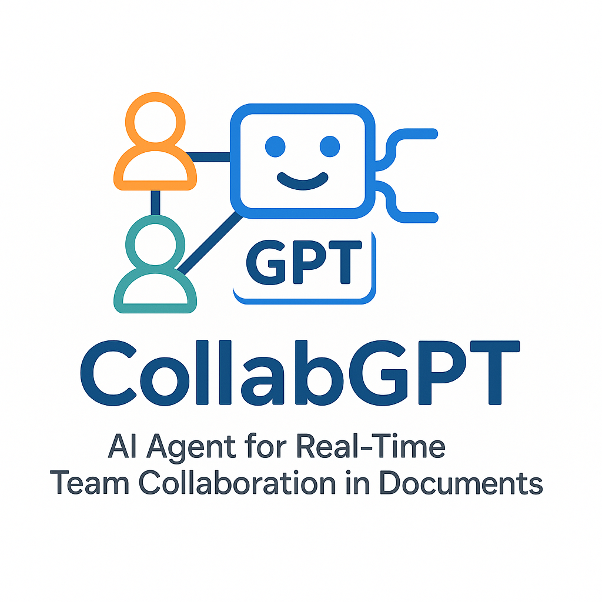

# CollabGPT



## AI Agent for Real-Time Team Collaboration in Documents

CollabGPT is an innovative AI agent designed to seamlessly integrate with document collaboration workflows, acting as an intelligent team member that helps summarize changes, suggest edits, and resolve conflicts in real-time.

### Project Vision

Transform document collaboration by introducing an AI teammate that understands context, monitors changes, and provides timely suggestions to improve team productivity and document quality.

### Key Features

- **Real-time change monitoring** via webhooks/API integration
- **Intelligent summarization** of document edits
- **Contextual suggestions** based on document history and team conversations
- **Conflict detection and resolution assistance**
- **Next steps recommendations** for document completion

### Technology Stack

- **Document Integration**: Google Docs API (expandable to other platforms)
- **AI Framework**: LangChain Agent for orchestration and reasoning
- **Knowledge Enhancement**: RAG (Retrieval Augmented Generation) for contextual understanding
- **Language Models**: Integration with open-source LLMs for privacy and customization

### Use Cases

- **Team Documentation**: Collaborative creation and maintenance of team documentation
- **Content Creation**: Streamlining the editorial and review process
- **Meeting Notes**: Collaborative note-taking with real-time suggestions
- **Project Planning**: Dynamic document-based planning with AI assistance
- **Knowledge Management**: Maintaining consistency across organizational documents

### Development Status

This project is in active development. See the [ROADMAP.md](ROADMAP.md) file for detailed development phases and planned features.

### Getting Started

Follow these steps to set up and run CollabGPT on your local machine:

#### Prerequisites

- Python 3.8 or higher
- Google Docs API access
- (Optional) An LLM API key if using cloud-based language models

#### Installation

1. **Clone the repository**
   ```bash
   git clone https://github.com/yourusername/CollabGPT.git
   cd CollabGPT
   ```

2. **Create a virtual environment and install dependencies**
   ```bash
   python -m venv venv
   source venv/bin/activate  # On Windows, use: venv\Scripts\activate
   pip install -r requirements.txt
   ```

3. **Set up environment variables**
   ```bash
   cp .env.example .env
   ```
   Edit the `.env` file with your configuration settings.

4. **Configure Google Docs API access**
   - Go to the [Google Cloud Console](https://console.cloud.google.com/)
   - Create a new project or select an existing one
   - Enable the Google Docs API and Google Drive API
   - Create OAuth credentials (or a service account if needed)
   - Download the credentials file and save it to `credentials/google_credentials.json`

5. **Download NLTK resources** (if needed)
   ```bash
   python download_nltk_resources.py
   ```

6. **Run the application**
   ```bash
   python main.py
   ```

#### Adding Documents to Monitor

To add a Google Doc for monitoring:
```bash
python monitor_doc.py
```

#### Setting up Webhooks for Real-time Monitoring

For real-time document change monitoring:
```bash
python setup_webhook.py
```

#### Configuration Options

Most configuration options can be set through environment variables in your `.env` file:

- **COLLABGPT_ENV**: Set the environment (`development`, `production`, `testing`)
- **WEBHOOK_HOST/PORT**: Configure the webhook server 
- **LLM_MODEL_PATH/LLM_API_KEY**: Configure your LLM settings
- See `.env.example` for all available options

#### Security Considerations

- Never commit sensitive API keys, tokens, or credentials to your repository
- For production deployments, ensure proper authentication and data encryption
- Review the Google Docs API usage policies and respect user privacy

For more detailed information on specific features, refer to the [ROADMAP.md](ROADMAP.md) file.

### Contributing

We welcome contributions to CollabGPT! Whether you're interested in improving the AI capabilities, enhancing document integration, or refining the user experience, please refer to our [contribution guidelines](CONTRIBUTING.md).

### License

This project is licensed under the MIT License - see the [LICENSE](LICENSE) file for details.

---

CollabGPT aims to become the gold standard for AI-assisted document collaboration, proving that AI agents can be valuable teammates in everyday knowledge work.